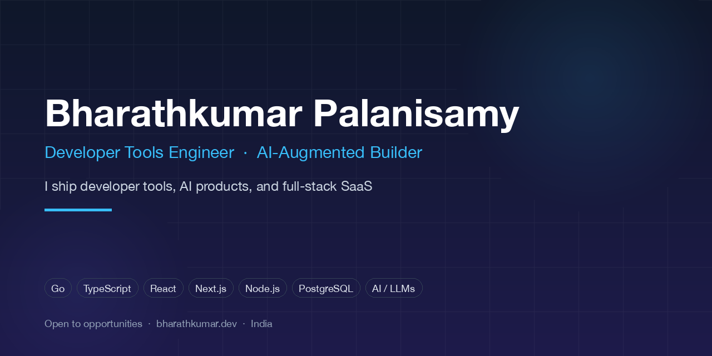

### Bharathkumar Palanisamy — Developer Tools Engineer

Chrome extensions · macOS apps · CLIs & TUIs · solo bootstrapped products

I'm an AI product engineer: I use Claude Code and Cursor to take a product from idea to shipped, alone.

**Open to Developer Tools, Product Engineering and AI Product Engineer roles. Remote (India or global). I also build and sell my own products.**

---

## What I do

- **Developer tools**: Go and TypeScript CLIs/TUIs, MCP servers, release pipelines, Homebrew/npm distribution. [git-scope](https://github.com/Bharath-code/git-scope) has **123★, 14 forks, 8 contributors, 17 releases**.
- **Chrome extensions**: Manifest V3, service workers, paid-tier logic. Several built, one actively developed.
- **macOS apps**: native Swift apps, with notarization and DMG packaging worked through.
- **Solo bootstrapped products**: I write the PRD, pricing, and go-to-market docs alongside the code, then build and deploy on Cloudflare, Vercel and Convex.

Stack: **TypeScript, Next.js, Go, Swift, Rust, Cloudflare Workers/D1, Convex, PostgreSQL**, and the Claude, OpenAI and Gemini APIs.

---

## Selected work

### Developer tools

| Project | What it does | Stack | Evidence |
| :--- | :--- | :--- | :--- |
| **[git-scope](https://github.com/Bharath-code/git-scope)** | Scan, search and switch across every git repo on disk. | Go, Bubble Tea | 123★, Homebrew + npm |
| **[regressGuard](https://github.com/Bharath-code/regressGuard)** | Pre-commit regression detection. Ships as an **MCP server** so AI coding agents verify their own edits. | Go, MCP | 7 releases (v0.2.4), reproducible demo |
| **[recall](https://github.com/Bharath-code/recall)** | Local-first shell history and project memory for Claude Code and Cursor over **MCP**. | TypeScript, Bun | [Homebrew tap](https://github.com/Bharath-code/homebrew-recall), CI release |
| **[mcp-scope](https://github.com/Bharath-code/mcp-scope)** | Audits which MCP tool Claude actually picks and the token cost of your tool definitions. | Workers, Durable Objects, D1 | strict `tsc`, vitest |

### Chrome extensions

| Project | What it does | Evidence |
| :--- | :--- | :--- |
| **[DeepWork Tab](https://github.com/Bharath-code/deepwork-tab)** | Focus mode for Chrome: hard tab cap, calm intercept screen, a queue that makes closing feel safe. | MV3, v0.3.0, PRICING / GTM / FINANCE docs in-repo |
| **[Scroll Shame](https://github.com/Bharath-code/scroll_shame_extension)** | Browser extension with options, popup and report views. | PRD, landing page |
| **[TabGuard](https://github.com/Bharath-code/tabguard)** | Tab management extension with payment handlers. | Jest tests |

### macOS apps

| Project | What it does | Evidence |
| :--- | :--- | :--- |
| **[CaffeineBar](https://github.com/Bharath-code/caffeinebar)** | Native macOS menu-bar app. | PRD, HIG notes, notarization rehearsal, landing page |
| **[FolderMind](https://github.com/Bharath-code/foldermind)** | Native Swift macOS app. | Tests, `.dmg` build |

### Products

| Project | What it does | Evidence |
| :--- | :--- | :--- |
| **[signet](https://signet-ruby.vercel.app)** | AI email signatures from your website: Firecrawl, Gemini, Resend. | Live, Next.js 16 |
| **[RivalEye](https://rivaleye.vercel.app)** | Competitor price, tech-stack and branding monitoring with AI briefs. | Live |
| **[competepulse](https://github.com/Bharath-code/competepulse)** | Slack-native competitive-change agent. | Eval gate, deploy runbook, pilot checklist |
| **[DialScrub](https://github.com/Bharath-code/dialscrub)** | Pre-dial scrub API for AI voice agents (Vapi/Retell). | Python, MCP server, GTM plan |

[All repositories](https://github.com/Bharath-code?tab=repositories)

---

## How I work

- **One person, whole product.** Idea, PRD, build, deploy, pricing, launch. AI tools do the typing; I own the decisions.
- **Ship, then measure.** Evals, release pipelines and runbooks live next to the code.
- **Talk to the user.** Interview briefs, ICP docs and pilot checklists are in my repos because a product is only right when the customer says so.

---

## Writing

- [Why Git Breaks Down with Many Repos (and What I Built Instead)](https://medium.com/@kumarbharath63/why-git-breaks-down-with-many-repos-and-what-i-built-instead-2513233d0ea6)
- [How I Built In-App Workspace Switching for Multi-Repo Git Workflows](https://dev.to/iam_pbk/how-i-built-in-app-workspace-switching-for-multi-repo-git-workflows-4cbh)
- [snip: Terminal Snippet Manager](https://dev.to/iam_pbk/snip-terminal-snippet-manager-570g)

---

**Hiring, or want to talk about a product?**
[kumarbharath63@gmail.com](mailto:kumarbharath63@gmail.com) · [LinkedIn](https://linkedin.com/in/bharathkumar-palanisamy) · [bharathkumar.dev](https://www.bharathkumar.dev)

